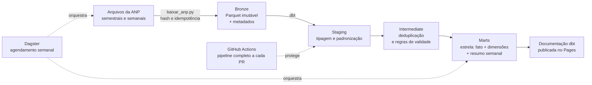

# Radar de Preços de Combustíveis


Plataforma de dados ponta a ponta sobre a Série Histórica de Preços de
Combustíveis da ANP: ingestão versionada, arquitetura medalhão,
transformação com dbt, testes de qualidade, orquestração com Dagster e
integração contínua que executa o pipeline inteiro a cada alteração.

## O problema de negócio

A ANP publica toda semana os preços coletados em milhares de postos do
país. O dado é público, mas chega cru: arquivos que mudam de encoding
entre anos, CNPJ com e sem máscara, decimal com vírgula, valor de
compra ausente na maior parte das linhas, fontes que se sobrepõem de
propósito e linhas duplicadas.

Quem precisa responder perguntas como "onde o preço da gasolina está
fora da curva nesta semana" ou "como a margem se comporta por bandeira
e região" não consegue trabalhar em cima do arquivo bruto. Precisa de
uma base confiável, testada e atualizada sem intervenção manual.

## A decisão que a plataforma habilita

O modelo final, `mart_resumo_semanal`, entrega por semana, UF e
produto: mediana, quartis, extremos e variação contra a semana
anterior. Com isso, uma rede de postos compara seus preços com o
mercado local, um analista de abastecimento identifica movimentos
atípicos e um órgão de defesa do consumidor prioriza fiscalização.

## Arquitetura



Camadas:

| Camada | Onde vive | Responsabilidade |
| --- | --- | --- |
| Bronze | Parquet em `data/bronze/` | Fidelidade ao original: tudo como texto, com `_arquivo_origem` e `_ingerido_em` |
| Staging | View no DuckDB | Tipagem, renomeação, padronização de chaves. Nenhuma regra de negócio |
| Intermediate | View no DuckDB | Deduplicação determinística e primeira regra de validade, vigiada por teste |
| Marts | Tabelas no DuckDB | Modelo estrela e resumo semanal de decisão |

## Qualidade como parte do pipeline

São 29 testes executados em todo build, cobrindo três categorias:

1. Integridade estrutural: unicidade de chaves, não nulidade,
   relacionamentos entre fato e dimensões.
2. Regras de negócio: preços dentro de faixa plausível (erro),
   proporção de margens negativas (aviso), taxa de exclusão da limpeza
   sob controle (aviso).
3. Frescor da fonte: `dbt source freshness` acusa quando a ingestão
   parou de trazer dado novo.

A distinção entre erro e aviso é deliberada: erro bloqueia o pipeline,
aviso pede investigação humana sem parar a operação.

## Resultados

Números da execução com os arquivos oficiais da ANP (agosto de 2026):

| Indicador | Valor |
| --- | --- |
| Período coberto | 1 de julho de 2025 a 14 de agosto de 2026 |
| Linhas ingeridas na camada bronze | 873.859 |
| Coletas válidas na tabela fato | 873.853 (6 excluídas pela limpeza) |
| Postos distintos | 9.307 |
| Produtos | 6 (gasolina, gasolina aditivada, etanol, diesel, diesel S10, GNV) |
| Resumo semanal | 8.573 combinações de semana, UF e produto, nas 27 UFs |
| Testes de qualidade | 29, todos passando |

Comportamentos verificados nessa execução:

- Idempotência: na segunda execução do dia, os 4 arquivos da ANP foram
  reconhecidos como inalterados por hash e pulados, sem reprocessamento
  nem duplicação.
- Contrato de qualidade em ação: na primeira execução com dados reais,
  o teste de unicidade de `dim_produtos` acusou que o mesmo produto
  chegava com a unidade de medida grafada de duas formas conforme o
  ano do arquivo, e bloqueou a publicação das marts. A correção entrou
  em duas camadas (normalização no staging e grão garantido por
  agregação na dimensão) e os dados de exemplo passaram a reproduzir a
  variação, para a integração contínua cobrir o caso.
- Bronze de um único modo por vez: a primeira leitura dos resultados
  reais trouxe 2.831 linhas de 2023 e 2024 que não existiam na fonte;
  eram os dados de exemplo, carregados antes na mesma pasta. A ingestão
  passou a limpar os Parquet do outro modo ao trocar entre amostra e
  real, e o registro de decisões documenta o caso.
- Encoding Latin-1 e UTF-8 processados de forma transparente.
- Linhagem completa visível na interface do Dagster, do download da
  ANP até o mart final, como um único grafo.
- CI executa o pipeline inteiro a cada pull request usando os dados de
  exemplo versionados: nenhum merge entra sem os testes passarem.

Sobre a base de exemplo (2.857 linhas), o pipeline completo executa em
cerca de 3 segundos.

## Como executar

Pré-requisitos: Python 3.11 ou superior e Git.

```bash
git clone https://github.com/vitordjk/radar-precos-combustiveis.git
cd radar-precos-combustiveis
python -m venv .venv

# Windows (PowerShell)
.venv\Scripts\Activate.ps1
# Linux ou macOS
source .venv/bin/activate

pip install -r requirements.txt

# 1. Camada bronze com os dados de exemplo (offline)
python ingestao/para_bronze.py --modo amostra

# 2. Transformação e testes
dbt deps --project-dir dbt --profiles-dir dbt
dbt build --project-dir dbt --profiles-dir dbt

# 3. Interface do Dagster
dagster dev -f orquestracao/definitions.py
```

Para trabalhar com os dados reais da ANP:

```bash
python ingestao/baixar_anp.py
python ingestao/para_bronze.py --modo real
dbt build --project-dir dbt --profiles-dir dbt
```

Execução opcional com Docker: `docker compose up --build` e a
interface do Dagster sobe em `http://localhost:3000`.

O passo a passo completo, com a explicação de cada decisão, está em
[GUIA_PASSO_A_PASSO.md](GUIA_PASSO_A_PASSO.md).

## Estrutura do repositório

```
radar-precos-combustiveis/
├── ingestao/            Download da ANP e conversão para bronze
│   ├── fontes.yml       Manifesto de URLs (verificadas em ago/2026)
│   ├── baixar_anp.py    Download com hash e suporte a ZIP
│   └── para_bronze.py   CSV bruto para Parquet com metadados
├── dados_exemplo/       Fixtures no formato real da ANP, para CI e demonstração
├── dbt/                 Projeto de transformação
│   ├── models/          staging, intermediate e marts
│   ├── tests/           Testes singulares de regra de negócio
│   ├── seeds/           Tabela de apoio de estados e regiões
│   └── macros/          Conversão decimal pt-BR e schemas limpos
├── orquestracao/        Definições do Dagster (assets, job, agendamento)
├── .github/workflows/   CI e publicação da documentação no Pages
└── docs/                Arquitetura e registro de decisões
```

## Documentação

- [Guia passo a passo](GUIA_PASSO_A_PASSO.md): como o projeto foi
  construído, fase por fase, com o porquê de cada escolha.
- [Arquitetura](docs/arquitetura.md): camadas, contratos entre elas e
  fluxo de dados.
- [Registro de decisões](docs/decisoes.md): as cinco decisões técnicas
  centrais e o que foi descartado em cada uma.

## Fonte dos dados

Série Histórica de Preços de Combustíveis, publicada pela Agência
Nacional do Petróleo, Gás Natural e Biocombustíveis (ANP) como dado
aberto. Os arquivos em `dados_exemplo/` seguem o formato oficial, mas
contêm valores fictícios gerados para permitir execução offline e
testes de integração contínua.
