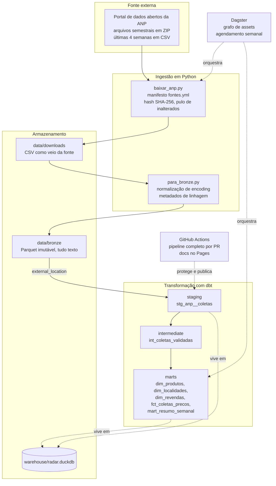

# Arquitetura

## Visão geral

## Contratos entre camadas

A palavra contrato aqui é literal: cada camada promete algo à
seguinte, e os testes verificam a promessa.

**Bronze promete ao staging:** todo arquivo processado da fonte está
presente como Parquet, com todas as colunas originais em texto e com
`_arquivo_origem` e `_ingerido_em` preenchidos. Nada foi filtrado,
nada foi convertido.

**Staging promete à intermediate:** colunas renomeadas para snake_case,
tipos corretos (data como date, valores como decimal), CNPJ apenas com
dígitos, produto e bandeira em caixa alta. Valores impossíveis de
converter viram nulos, nunca erro silencioso.

**Intermediate promete às marts:** uma linha por posto + produto +
data (deduplicação determinística, vence a ingestão mais recente),
somente coletas com preço de venda positivo, data presente e CNPJ com
14 dígitos, e flags de qualidade calculadas (`tem_margem_calculavel`,
`e_margem_negativa`). O teste de taxa de exclusão vigia quanto está
sendo descartado.

**Marts prometem ao consumidor:** modelo estrela navegável
(fato com chaves para as três dimensões) e um resumo semanal com
estatísticas robustas (mediana e quartis) pronto para BI, com
unicidade garantida no grão semana + UF + produto.

## Fluxo de uma linha, do portal ao mart

1. `baixar_anp.py` encontra `ca-2026-01.zip` no manifesto, baixa,
   extrai o CSV e compara o hash com o download anterior. Conteúdo
   novo: o arquivo em `data/downloads/` é substituído.
2. `para_bronze.py` detecta o encoding, regrava em UTF-8 e converte
   para `data/bronze/anp/ca-2026-01.parquet`, acrescentando as colunas
   de metadados. O hash do CSV entra no registro de estado.
3. No build do dbt, o staging lê todos os Parquet do bronze de uma vez
   (`read_parquet` com `union_by_name`), tipa e padroniza.
4. A intermediate elimina a sobreposição entre o arquivo semestral e o
   de últimas 4 semanas e aplica as regras de validade.
5. As marts remontam o dado em estrela e agregam o resumo semanal.
6. Os 29 testes rodam no mesmo build. Qualquer erro interrompe antes
   de dado ruim chegar ao consumo.

## Decisões de nomenclatura

- Modelos com prefixo por camada (`stg_`, `int_`, `dim_`, `fct_`,
  `mart_`), convenção difundida pela comunidade dbt que torna a
  função de cada modelo legível pelo nome.
- Colunas e conteúdo de negócio em português, consistente com o resto
  do portfólio e com o público leitor.
- Schemas limpos (`bronze` como fonte lógica, `staging`, `marts`,
  `apoio`) via macro `generate_schema_name`.
